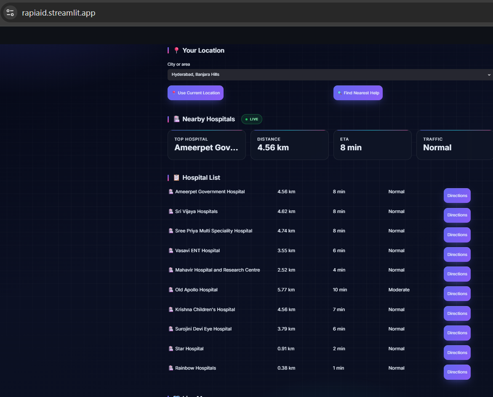
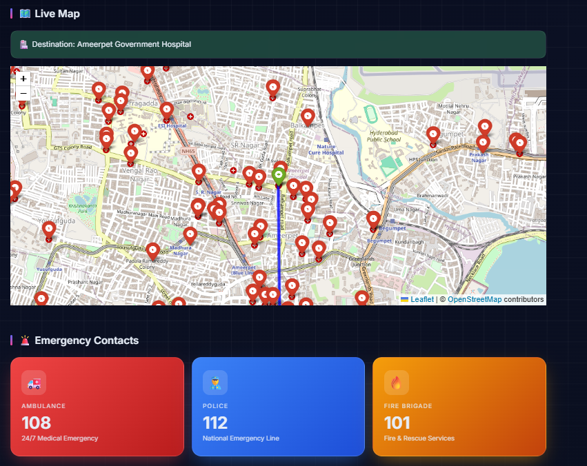

# RapidAid

> Real-Time Emergency Hospital Locator & Route Navigation System

RapidAid is an AI-assisted emergency navigation platform designed to help users quickly locate nearby hospitals, estimate travel time, analyze traffic conditions, and view routes on a live map during critical situations.

---

# Problem Statement

In emergency situations, people often lose valuable time searching for nearby hospitals and determining the fastest route. Delays in reaching medical facilities can significantly impact patient outcomes.

RapidAid addresses this challenge by providing real-time hospital discovery, route estimation, traffic insights, and live map visualization in a single platform.

---

# Solution

RapidAid combines location services, mapping technologies, and routing APIs to help users:

- Find nearby hospitals instantly
- Calculate shortest travel routes
- Estimate travel time (ETA)
- View traffic conditions
- Navigate using an interactive live map

The system uses real-time geographic data instead of static datasets, ensuring accurate and up-to-date information.

---

# Key Features

- 📍 Convert user locations into coordinates
- 🏥 Discover nearby hospitals in real time
- 🛣️ Calculate shortest routes
- ⏱️ Estimate travel time (ETA)
- 🚦 Display traffic status
- 🗺️ Interactive live map visualization
- 📌 Hospital location markers
- 🚑 Emergency contact section
- 🌍 Real-time OpenStreetMap integration

---

# Application Screenshots

## Dashboard


---

## Location Search


---

## Nearby Hospitals



---

## Hospital Route & Live Map



---

# Project Workflow

```text
User Location
      ↓
Geocoding (Geopy + Nominatim)
      ↓
Latitude & Longitude
      ↓
OpenStreetMap Overpass API
      ↓
Nearby Hospitals
      ↓
OpenRouteService API
      ↓
Distance & ETA
      ↓
Traffic Analysis
      ↓
Interactive Map Display
```

---

# System Architecture

```text
Frontend (Streamlit)
        │
        ▼
Location Service
(Geopy + Nominatim)
        │
        ▼
Hospital Search Service
(Overpass API)
        │
        ▼
Route Calculation Service
(OpenRouteService API)
        │
        ▼
Traffic & ETA Analysis
        │
        ▼
Live Map Visualization
(Folium)
```

---

# Technologies Used

| Component | Technology |
|------------|------------|
| Frontend | Streamlit |
| Backend | Python |
| Mapping | Folium |
| Geocoding | Geopy |
| Hospital Search | OpenStreetMap Overpass API |
| Routing | OpenRouteService API |
| Map Data | OpenStreetMap |
| Version Control | Git & GitHub |

---

# APIs Used

## 1. Nominatim (OpenStreetMap)

Used to convert user-entered locations into geographic coordinates.

Example:

```text
Hyderabad → (17.3850, 78.4867)
```

---

## 2. Overpass API

Used to retrieve nearby hospitals from OpenStreetMap based on the user's location.

Features:

- Real-time hospital discovery
- Location-based search
- Open-source geographic data

---

## 3. OpenRouteService API

Used to calculate:

- Distance
- Travel Time (ETA)
- Route Information

---

# Project Structure

```text
RapidAid/
│
├── app.py
├── requirements.txt
├── README.md
│
├── screenshots/
│   ├── Dashboard.png
│   ├── Location.png
│   ├── Hospitals.png
│   └── Hospital-location.png
│
└── services/
    ├── location.py
    ├── hospitals.py
    └── routes.py
```

---

# Backend Services

## Location Service

**File:** `services/location.py`

**Function:**

```python
get_coordinates(address)
```

Purpose:

Converts user-entered locations into latitude and longitude coordinates.

---

## Hospital Search Service

**File:** `services/hospitals.py`

**Function:**

```python
get_nearby_hospitals(lat, lon)
```

Purpose:

Retrieves nearby hospitals around the user's location.

---

## Routing Service

**File:** `services/routes.py`

**Function:**

```python
get_route(start_lat, start_lon, end_lat, end_lon)
```

Purpose:

Calculates route distance and estimated travel time.

---

## 🚦 Traffic Status Service

**Function:**

```python
traffic_status(eta)
```

Purpose:

Provides a simple traffic indicator based on ETA.

---

# 🚀 Installation

### Clone Repository

```bash
git clone https://github.com/ani08-git/RapiAid.git
```

### Navigate to Project

```bash
cd RapiAid
```

### Create Virtual Environment

```bash
python -m venv venv
```

### Activate Environment

Windows:

```bash
venv\Scripts\activate
```

### Install Dependencies

```bash
pip install -r requirements.txt
```

### Run Application

```bash
streamlit run app.py
```

---

# Future Enhancements

- 🚑 Live Ambulance Tracking
- 🏥 Hospital Specialization Filters
- 📞 Emergency Contact Integration
- 🤖 AI-Based Emergency Recommendations
- 🚦 Advanced Traffic Prediction
- 📍 GPS-Based Current Location Detection
- 📱 Mobile Application Support

---

# 👥 Team

### RapidAid Hackathon Team

**Pandhare Shivani**

**M. Anila Cyble**

---

# Conclusion

RapidAid helps users make faster and smarter decisions during emergencies by combining real-time hospital discovery, route navigation, ETA estimation, and live mapping into a single easy-to-use platform.

**Built for saving time when every second matters. 🚑**